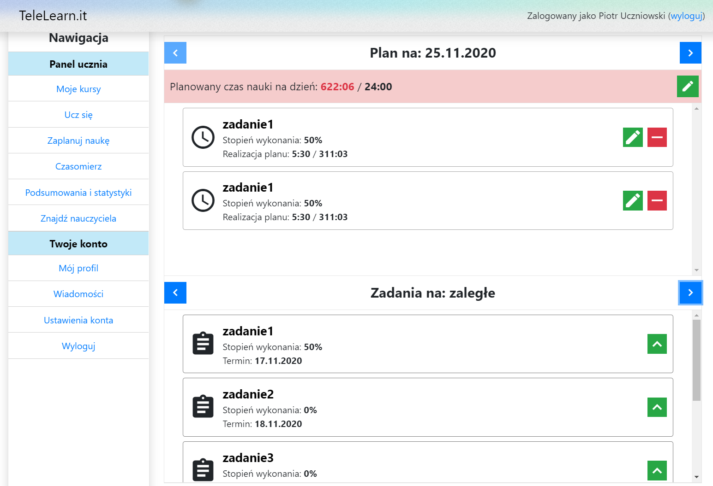
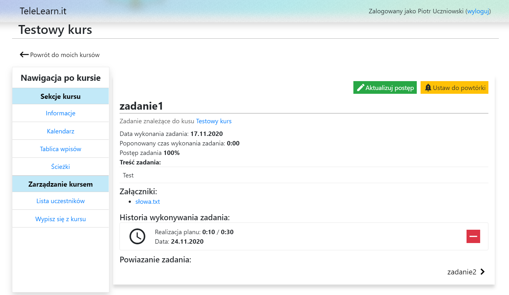
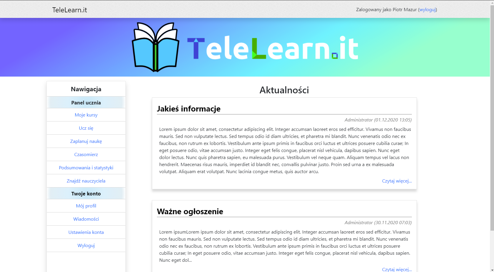
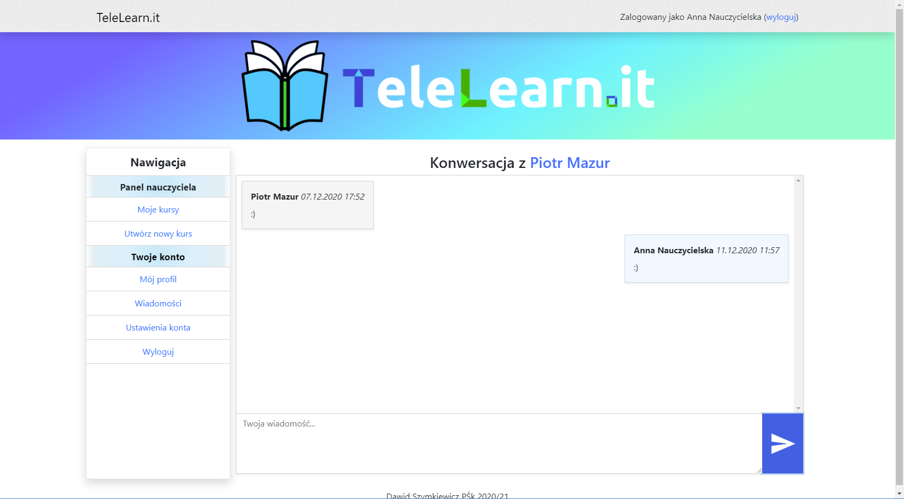
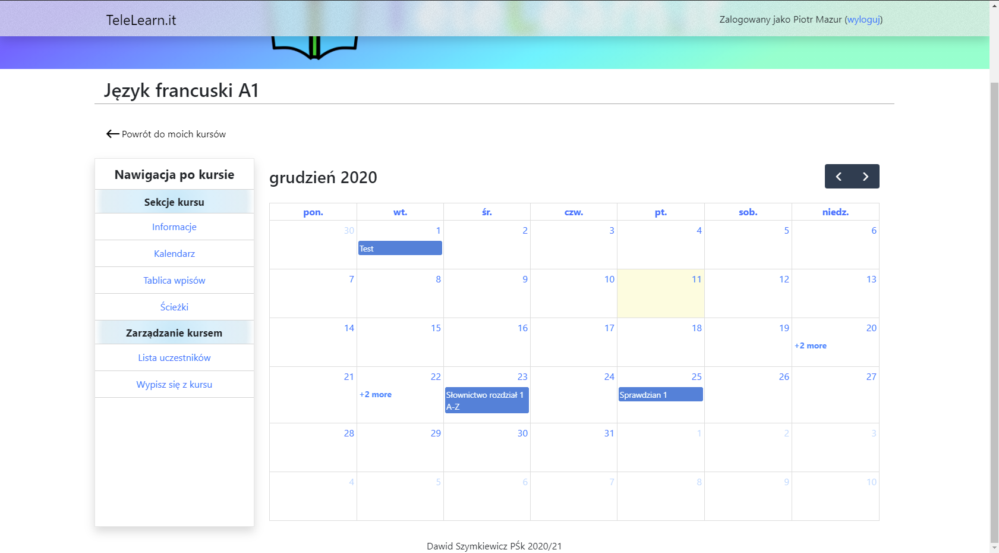
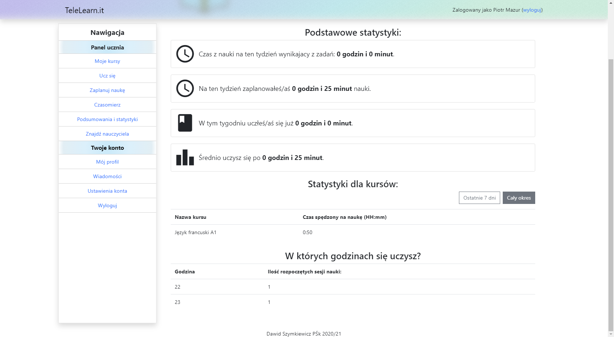
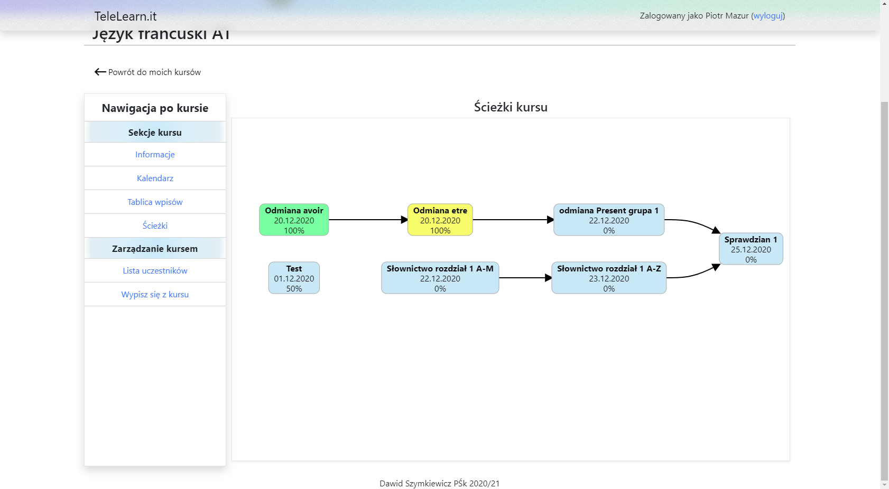
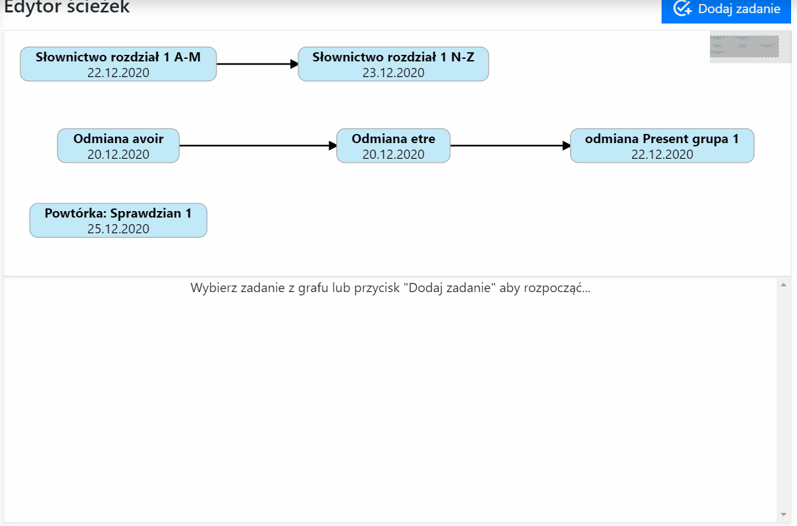

# TeleLearn- Frontend
TeleLearn is a three-tier application. PostgreSQL was chosen as the database, Java and Spring Boot were used in the backend layer, while the frontend layer was made in the Angular framework. The developed application focuses on the student and the organization of the time they spent on learning. The base element of this system is courses. They contain tasks that represent the portion of the material to be learned in a given time. They are related to each other, which allows defining the order of their completion. Students can create their study scheme for specific days and hours. Besides, the application allows to display statistics for the student, share materials as files, exchange information on the course post board, and send private messages.
# Visuals

